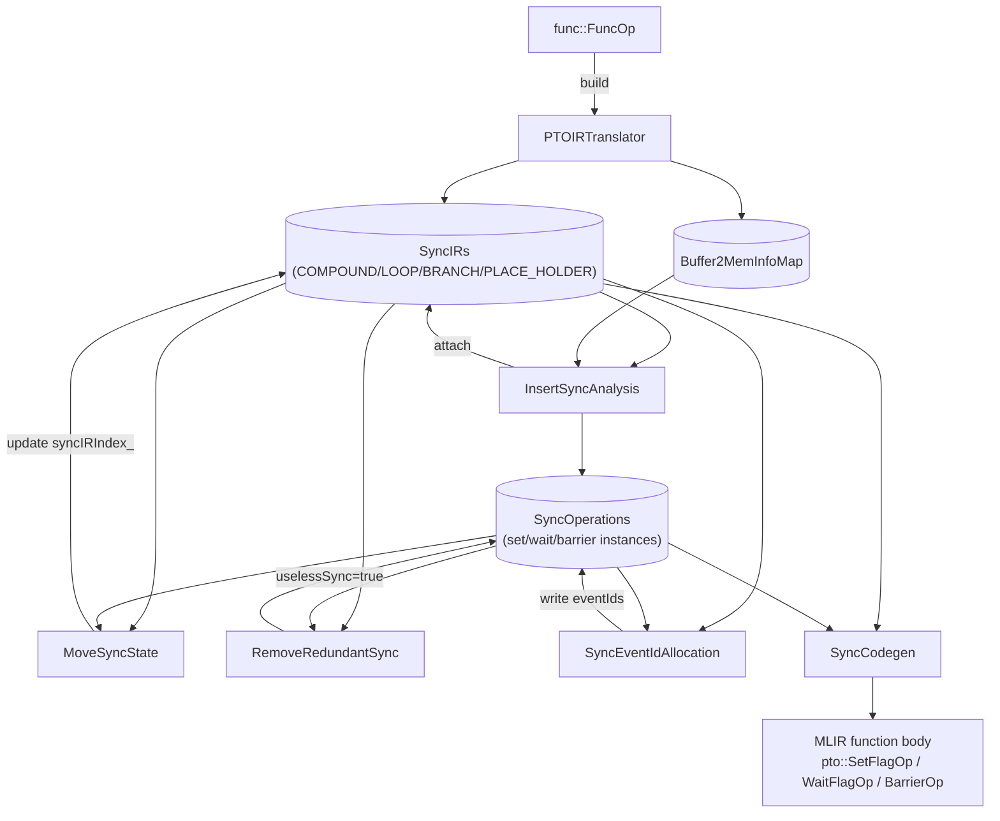
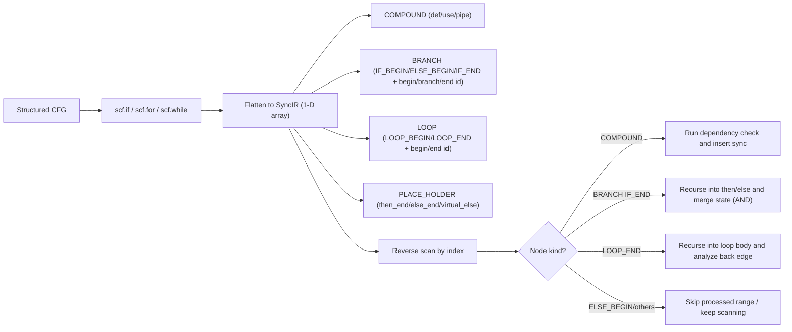
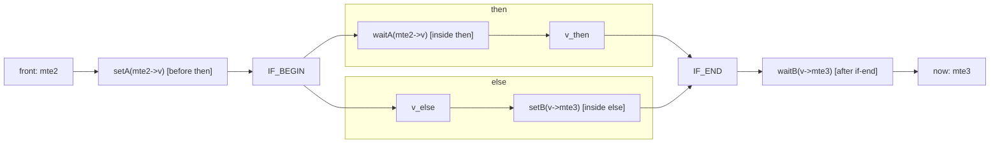
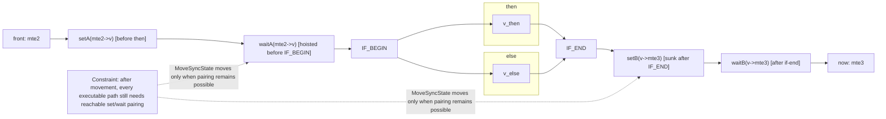
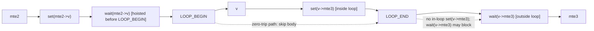
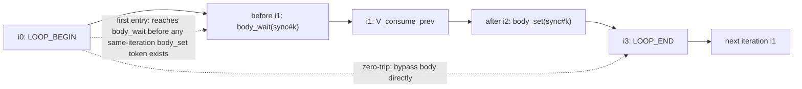
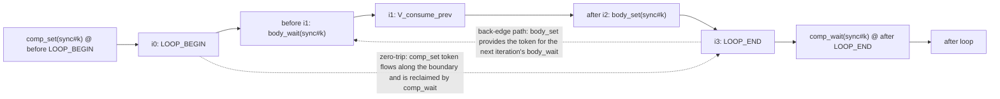

# PTOAS InsertSync Auto-Synchronization Mechanism

This document focuses on three core questions: how dependencies are detected, how synchronization is inserted, and how event ids are allocated.

---

## 1. Background: Out-of-Order Risks From the Hardware Architecture and the Need for Synchronization

In PTOAS, instructions do not execute serially in source order. Multiple pipes run in parallel, so timing races can occur whenever a producer and a consumer access the same underlying memory. InsertSync converts these real dependencies into the minimum required synchronization.

First, define the common pipe types used in this document:

- `PIPE_MTE2`: inbound movement, commonly GM -> L1/UB.
- `PIPE_V`: vector compute.
- `PIPE_M`: matrix compute.
- `PIPE_MTE3`: outbound movement, commonly L1/UB -> GM.
- `PIPE_S`: scalar and control assistance.

The most common data path is `MTE2 -> V/M -> MTE3`. When pipes share underlying memory, synchronization is required for correctness.

---

## 2. The Flow Is Simple, but the Order Matters

The `PTOInsertSync` pass runs in this order:

`PTOIRTranslator -> InsertSyncAnalysis -> MoveSyncState -> RemoveRedundantSync -> SyncEventIdAllocation -> SyncCodegen`

This pipeline can be split into three phases:

1. Detect dependencies and generate synchronization analysis objects.
2. Mark synchronization placement clearly at control-flow boundaries.
3. Allocate event ids and materialize real instructions.

---

## 3. Core Data Structures

The implementation lives in `lib/PTO/Transforms/InsertSync/`, with corresponding headers in
`include/PTO/Transforms/InsertSync/`. This section collects the key types that flow through the entire pass pipeline. Later algorithm sections refer to these fields repeatedly.

### 3.1 Top-Level Containers

| Type Alias | Definition | Role |
| --- | --- | --- |
| `SyncIRs` | `SmallVector<std::unique_ptr<InstanceElement>>` | Flattened instruction sequence shared between passes |
| `SyncOperations` | `SmallVector<SmallVector<std::unique_ptr<SyncOperation>>>` | Storage for synchronization pairs; outer index = `kSyncIndex`, inner slot 0/1 corresponds to set/wait (a barrier occupies only one slot) |
| `Buffer2MemInfoMap` | `DenseMap<Value, SmallVector<std::unique_ptr<BaseMemInfo>>>` | SSA Value -> a group of `BaseMemInfo` records used to track views and aliases |
| `SyncOps` | `std::deque<SyncOperation*>` | `pipeBefore` / `pipeAfter` synchronization queues on a node |

`PTOInsertSyncPass::runOnOperation` (`PTOInsertSync.cpp:64`) creates these four containers once, then passes them to the following six passes in order. The containers are converted into real `pto::SetFlagOp / WaitFlagOp / BarrierOp` only at the final `SyncCodegen::Run()` stage.

### 3.2 SyncIR Nodes: The `InstanceElement` Family

`InstanceElement` (`SyncCommon.h:229`) is the abstract base class. Every node carries:

- `unsigned kIndex`: the stable index of the node in `syncIR_`, exposed through `GetIndex()`.
- `Operation* elementOp`: pointer to the source MLIR op (a COMPOUND node points to the annotated op; a control-flow node points to its region-boundary op, such as `scf::ForOp`, `scf::IfOp`, or `scf::YieldOp`).
- `SyncOps pipeBefore` / `SyncOps pipeAfter`: synchronization instruction queues attached before or after the node.
- `KindTy kKindTy`: one of `COMPOUND`, `LOOP`, `BRANCH`, or `PLACE_HOLDER`.

Derived classes are distinguished by kind. Their fields mean:

| Derived Class | Key Fields | Description |
| --- | --- | --- |
| `CompoundInstanceElement` | `defVec`, `useVec` (both `SmallVector<const BaseMemInfo*>`), `kPipeValue` (`PipelineType`), `opName`, `compoundCoreType` (`TCoreType`) | Compute/movement instruction node; `def/use` is the input for dependency checks during reverse scanning. `compoundCoreType` distinguishes CUBE / VECTOR for later barrier selection |
| `LoopInstanceElement` | `beginId`, `endId`, `kLoopKind` (`LOOP_BEGIN`/`LOOP_END`) | A pair of nodes shares the same `beginId/endId`; endpoints appear as a matched pair |
| `BranchInstanceElement` | `beginId`, `branchId`, `endId`, `kBranchKind` (`IF_BEGIN`/`ELSE_BEGIN`/`IF_END`) | `branchId` = the start of the else interval; if there is no else, `branchId == endId` |
| `PlaceHolderInstanceElement` | `parentScopeId`, `isVirtualElse`, `parentIfOp` | Placeholder anchor: the yield position at the end of then/else; when `isVirtualElse=true`, `SyncCodegen` creates a real else block on demand |

The three enums `KindTy`, `KindOfLoop`, and `KindOfBranch` (`SyncCommon.h:234/267/290`) encode node kinds into the IR. Reverse scanning uses `dyn_cast` or `getKind()` to distinguish handling.
`MAX_MULTI_BUFFER_NUM = 16` (`SyncCommon.h:35`) is the upper bound for multi-buffer slots and determines the fixed length of `SyncRecordList`.

### 3.3 Memory Semantics Layer: `BaseMemInfo`

`BaseMemInfo` (`SyncCommon.h:86-131`) is the smallest unit for dependency checks:

| Field | Type | Role |
| --- | --- | --- |
| `baseBuffer` | `Value` | The SSA buffer directly visible to the current op (possibly the top of a view/cast chain) |
| `rootBuffer` | `Value` | The statically known root buffer (`alloc_tile` / kernel arg / `memref.alloc`) |
| `scope` | `pto::AddressSpace` | Address space (GM/MAT/VEC/ACC/LEFT/RIGHT, and so on) |
| `baseAddresses` | `SmallVector<uint64_t>` | Known offset list, used with `allocateSize` for exact interval-overlap checks |
| `allocateSize` | `uint64_t` | Size in bytes |

`operator==` (line 111) requires `baseAddresses`, `rootBuffer`, `scope`, `allocateSize`, and `baseBuffer` to all be equal before two buffers are considered the same. This is the "strict equality" check in alias analysis; when it matches, dependency handling can proceed directly.

### 3.4 Synchronization Instruction: `SyncOperation`

`SyncOperation` (`SyncCommon.h:137-219`) describes one set/wait/barrier instance.
Its key fields fall into two groups:

Identity and placement:

- `type_`: `SET_EVENT` / `WAIT_EVENT` / `PIPE_BARRIER` / `PIPE_BARRIER_CUBE`
  / `PIPE_BARRIER_VECTOR` / `SYNC_BLOCK_SET` / `SYNC_BLOCK_WAIT` / `SYNC_BLOCK_ALL`.
- `srcPipe_`, `dstPipe_`: pipeline direction.
- `kSyncIndex_`: pair index in `syncOperations_`; set and wait share the same value.
- `syncIRIndex_`: index of the attached SyncIR node; updated through `SetSyncIRIndex` during `MoveSyncState`.
- `forEndIndex_`: optional loop `endId` marker; if present, this synchronization is related to a back edge.

Allocation and pruning state:

- `eventIds` (`SmallVector<int>`) + `eventIdNum`: event id list populated after allocation; length = `eventIdNum` (greater than 1 in multi-buffer scenarios).
- `depRootBuffers`: the root-buffer set involved in the dependency chain that created this synchronization pair. It is used for allocation/widening heuristics and debug information. When `RemoveRedundantSync` deletes set/wait redundancy, it reasons by pipe-pair semantics and does not require root-buffer equality.
- `uselessSync`: set to true when `RemoveRedundantSync` matches; the operation is eventually removed from `pipeBefore/After`.
- `isCompensation`: reserved for synthetic compensation syncs created early by analysis. Current loop back-edge head/tail paired syncs are generated by `SyncEventIdAllocation` after redundant sync removal.
- `lowestCommonAncestorBuffer`, `reuseCntForWiden`, `reallocatedLoopHeadTailSync`: auxiliary allocation-stage state for widen/reallocate.

### 3.5 Reverse-Scan Local State: `SyncRecord`

`SyncRecord` (`InsertSyncAnalysis.h:25`) is the working set maintained for the current `now` during reverse scanning:

- `alreadySync`: `std::array<bool, PIPE_LAST + 1>`. Once a dependency from a pipe is covered by a set/wait pair, its slot is set to 1 and later hazards from the same source pipe do not get duplicate synchronization. Note that this is **pipe-level state** and does not distinguish a concrete `syncIndex`. Once `alreadySync[PIPE_MTE2] = true`, all later dependencies from `PIPE_MTE2` are considered covered.
- `syncFinder`: `DenseMap<int, bool>`, indexed by `kSyncIndex`. It records only that "the wait side of a `syncIndex` has already been seen during reverse scanning." It does not record the set side and is not equivalent to "some pipe is already synchronized." Only when the reverse scan continues farther backward and sees the set with the same `syncIndex` can the source pipe of that set be promoted into `alreadySync`. See Section 6.1, "Linear Example B", and the zero-trip examples in Section 6.4 for this state machine.

The update direction of `syncFinder` is easy to read backward: `UpdateSyncRecord` first uses `recordFinder[syncIndex]` to determine whether the current set can close a previously seen wait. Only when the current sync is `WAIT_EVENT` / `SYNC_BLOCK_WAIT` does it run `recordFinder[syncIndex] = true`.
Therefore, the `syncFinder-only` strategy carries "wait-side clues", not completed synchronization facts.

`SyncRecordList = std::array<SyncRecord, MAX_MULTI_BUFFER_NUM>`: each multi-buffer slot maintains independent state, with no cross-slot interference.

### 3.6 Event ID Allocation Pool: `EventCyclePool` / `SyncCycle`

`SyncEventIdAllocation.h:25-37` defines the constants and pool structures used during allocation:

```cpp
constexpr uint kTotalEventIdNum            = 8;   // Maximum id count for normal synchronization
constexpr uint kBlockSyncSetWaitEventIdNum = 16;  // BlockSync pool size
constexpr uint kBlockSyncAllCubeEventId    = 14;  // Reserved id for BlockAllCube
constexpr uint kBlockSyncAllVectorEventId  = 15;
constexpr uint kMaxWidenTryNum             = 99;  // Maximum widen reuse attempts

struct EventCyclePool {                 // Pool for one (srcPipe,dstPipe)
  SmallVector<SmallVector<unsigned>> slot;  // slot[id] = [s0, e0, s1, e1, ...]
};
using SyncCycle = DenseMap<int, EventCyclePool>;  // key = ScopePair(s)
```

`ScopePair(s)` encodes `(srcPipe, dstPipe)` as `((dstT << 8) | srcT) + 1`, so synchronization pairs in different directions compete for independent id pools. BlockSync uses 0 as a placeholder and is isolated from normal synchronization.
Each id stores paired lifecycle endpoint sequences in `slot[i]`; new allocations check for conflicts. `WidenEventId` and `ReallocatedEventId` try reuse and reallocation when ids are tight.

### 3.7 Codegen Mediator Structure: `SyncPipeBuild`

`SyncCodegen.h:26` defines this small structure:

```cpp
struct SyncPipeBuild { SyncOps pipeBefore; SyncOps pipeAfter; };
```

`SyncCodegen::UpdateOpInsertSync` aggregates the `pipeBefore/pipeAfter` queues from `SyncIR` nodes into `DenseMap<const Operation*, SyncPipeBuild>`, then locates concrete MLIR ops during the walk and finally generates `pto::SetFlagOp` / `pto::WaitFlagOp` / `pto::BarrierOp`.

---

## 4. Internal Pass Data Flow and Key Functions

`PTOInsertSyncPass::runOnOperation` (`PTOInsertSync.cpp:64-145`) runs six sub-passes in the order below. Each step consumes upstream containers and writes back to the same container set. This section gives a compact "input -> main logic -> output" summary for each stage and marks the key entry functions and locations.

### 4.0 Pass Trigger and Short-Circuiting

After entering the pass, the first action is not analysis; it walks the function body (`PTOInsertSync.cpp:73-84`). If `pto::SetFlagOp / WaitFlagOp / RecordEventOp / WaitEventOp` already exists, the pass returns immediately, avoiding extra automatic synchronization on IR that already has manual synchronization.
`PTOInsertSync.cpp:127-131` also checks separately whether the function contains `pto::TGather/TGatherB/TScatter/MGather/MScatter` ops. If so, it skips `RemoveRedundantSync` because gather/scatter on A5 conflicts with pipe-pair simplification.

### 4.1 `PTOIRTranslator::Build` (`PTOIRTranslator.cpp`)

- Input: `func::FuncOp`, empty `SyncIRs`, and empty `Buffer2MemInfoMap`.
- Main logic:
  1. `UpdateKernelArgMemInfo()`: register kernel arguments as GM root buffers.
  2. `RecursionIR(&func.getBody())`: preorder traversal of regions:
     - `pto::AllocTileOp` / `DeclareTileMemRefOp` / `PointerCastOp` /
       `memref::AllocOp` are written into `buffer2MemInfoMap_` through `Update*MemInfo`.
     - View / Subview / Cast / Mov call `UpdateAliasBufferInfo(result, source)`, linking the derived buffer's `BaseMemInfo` back to the original root.
     - `scf::ForOp` / `WhileOp` / `IfOp` / `YieldOp` are translated through `UpdateForOpInfo` /
       `UpdateWhileOpInfo` / `UpdateIfOpInfo` / `UpdateYieldOpInfo` into
       `LoopInstanceElement` / `BranchInstanceElement` / `PlaceHolderInstanceElement`, while ensuring `beginId/branchId/endId` are consistent across paired nodes.
     - Compute/movement ops that implement `OpPipeInterface` use `UpdatePTOOpInfo`:
       `getOpPipeline(op)` obtains the pipeline type, `MemoryEffectOpInterface` distinguishes read/write, `UpdateDefUseVec` fills `defVec/useVec`, and finally a `CompoundInstanceElement` is constructed and `emplace_back`ed into `syncIR_`.
- Output: `SyncIRs` (structured CFG has been flattened while semantic boundaries are preserved) and `Buffer2MemInfoMap`.
- Key invariant: ops with `PipelineType::PIPE_UNASSIGNED` do not participate in synchronization analysis and are skipped directly.

### 4.2 `InsertSyncAnalysis::Run` (`InsertSyncAnalysis.cpp`)

- Input: `SyncIRs` from 4.1, `MemoryDependentAnalyzer`, and empty `SyncOperations`.
- Main logic (`InsertSyncAnalysis.cpp:43-63`):
  1. Traverse top-level `syncIR_`:
     - `CompoundInstanceElement` -> `DealWithCompoundSync` (core synchronization insertion).
     - `LoopInstanceElement(LOOP_END)` -> `DealWithLoopSync` (back-edge compensation modeling).
     - `BranchInstanceElement` / `PlaceHolderInstanceElement` are skipped at top level and handled recursively.
  2. `DealWithCompoundSync` calls `InsertSeqSync(now, syncIR_, 0, now->GetIndex(), ...)`:
     reverse-scan from `now-1` and dispatch by node kind:
     - `CompoundInstanceElement` -> `InsertSync` -> `MemAnalyze`:
       first do fast pruning with `IsNoNeedToInsertSync` (same `PIPE_S`, same op and not a back edge), then use `MemoryDependentAnalyzer::DepBetween` to check RAW/WAR/WAW. On a match, call `InsertSyncOperation` to write set/wait or barrier, and maintain `SyncRecordList` through `UpdateAlreadySync`.
     - `LoopInstanceElement` -> `InsertLoopSync`: recursively scan the loop-body slice. Because a loop may execute zero times at runtime, body `alreadySync` learned by recursive scanning cannot be promoted to the outer scan state. The current implementation copies only the `syncFinder` learned inside the body back to the outer scan. This avoids deleting required loop-external sync on the zero-trip path in #533, while preserving set/wait matching clues for nested K-loops such as #564.
     - `BranchInstanceElement` -> `InsertBranchSync`: recursively scan then/else and merge with `MergeAlreadySync` by intersection (set only when both branches synchronized).
  3. `DealWithLoopSync` copies the `[beginId, endId)` slice into local `backSyncIr`, then uses `InsertBackForSync` to pair compounds in the loop body with producers from "the previous iteration". This is the implementation entry for the "loop-carried dependency" in Section 6.4.
  4. After all scanning finishes, if `insertBarAllAtLast=true`, call `InsertLastPipeAll` to append a global barrier after the last compound.
- Output: `pipeBefore/pipeAfter` in `SyncIRs` have been populated with `SyncOperation*`; `SyncOperations` stores the corresponding `unique_ptr` instances.
- Key invariant: each `kSyncIndex` has at most two inner slots (set+wait) or one slot (barrier).

### 4.3 `MoveSyncState::Run` (`MoveSyncState.cpp`)

- Input: output from 4.2.
- Main logic:
  - `MoveOutBranchSync`: traverse `IF_BEGIN` nodes, call `PlanMoveOutBranchSync` on the then/else sub-intervals, then dispatch to `PlanMoveOutIfWaitSync` (hoist wait) and `PlanMoveOutIfSetSync` (sink set). The match condition is that at least one side of the paired set/wait is completely outside the branch.
  - `MoveForSync`: loop version. `MoveOutSync` -> `PlanMoveOutWaitSync` /
    `PlanMoveOutSetSync` hoists/sinks sync pairs that can move before `LOOP_BEGIN` or after `LOOP_END`, making the boundary form readable and leaving anchors for later compensation.
- Output: updates `pipeBefore/pipeAfter` and `SyncOperation::syncIRIndex_` in place.
- Note: `MoveSyncState` does not change `kSyncIndex`; set/wait still pair through `syncOperations_[k]`. It only changes the attachment position.

### 4.4 `RemoveRedundantSync::Run` (`RemoveRedundantSync.cpp`)

- Trigger condition: see Section 4.0. If the function contains gather/scatter ops, this whole stage is skipped.
- Input: output from 4.3.
- Main logic:
  1. Collect all set/wait pairs where `syncOperations_[k].size()==2`, and sort by `forEndIndex` / `kSyncIndex` (inner first).
  2. For each `(setFlag, waitFlag)`: skip pre-generated compensation syncs marked `isCompensation`, then run `CheckAllSync`.
  3. `CheckAllSync` -> `CheckRepeatSync` scans `pipeBefore/pipeAfter` in the `[setIRIndex, waitIRIndex]` interval. It calls `CheckBranchBetween` for branches and `CheckLoopBetween` for loops. `CanMatchedSync` uses a `SmallVector<bool>` as a `syncFinder` state machine: after seeing a set with a different but matching `kSyncIndex`, it sets the state; after seeing the corresponding wait, it confirms the pair. As long as an internal complete sync pair has the same pipe pair and `eventIdNum` is not greater than the outer sync pair, the outer sync pair is considered covered.
  4. On a match, set `uselessSync=true` and remove the operation from attachment queues through `InstanceElement::RemoveSync`.
- Output: redundant `SyncOperation` instances remain in `syncOperations_` for printing/debugging, but no longer appear in any `SyncIR` node's `pipeBefore/After`.
- Conservative boundary: `CheckLoopBetween` returns false directly because a loop may execute zero times; `CheckBranchBetween` requires both then and else to cover the sync before treating it as redundant.

### 4.5 `SyncEventIdAllocation::Allocate` (`SyncEventIdAllocation.cpp`)

- Input: output from 4.4.
- Main logic (following `Allocate(runNum=0)`):
  1. **Initial allocation**: traverse `syncIR_`; for each set/wait in a node's `pipeBefore` that has not yet received an id, call `AllocateEventId -> SetEventId`:
     - `ScopePair(sync)` selects the id pool;
     - `GetEventPool` + `FindUseEventID` + `CheckSyncLifeCycleConflict` collect conflicts;
     - prefer an idle id (`GetEventIdIdleStatus`), then a reusable id (`GetAvailableEventId` / `UpdateBlockAvailableEventId`);
     - after selection, call `SetEventPool` and `SetUseEventID` to write back lifecycle data; for a back edge, `UpdateBackwardMatchSync` attaches the head/tail compensation pair to the same id.
  2. **Widen**: traverse again and call `WidenEventId` / `TryWidenByOtherSync` to try merging adjacent intervals within `kMaxWidenTryNum` attempts, shortening spans and increasing reuse.
  3. **Back-edge cleanup**: `IgnoreBackHeadAndTailSync` removes placeholder-only back-edge compensation syncs from the allocation view so they do not compete for ids again.
  4. **Reallocate**: if `reallocatedPipePair` is non-empty, call `ReallocatedEventId`, degrade to `eventIdNum=1`, and retry. If needed, recursively call `Allocate(runNum+1)`.
  5. **Degrade to PIPE_ALL**: `ChangeNoEventIdSyncToPipeAll` converts syncs that still have no id into a global barrier, ensuring code can be generated (trading performance for correctness).
- Key constants: `kTotalEventIdNum=8`, `kBlockSyncSetWaitEventIdNum=16`,
  `kBlockSyncAllCubeEventId=14`, `kBlockSyncAllVectorEventId=15`.
- Output: every non-useless `SyncOperation::eventIds` has been populated with legal ids.

### 4.6 `SyncCodegen::Run` (`SyncCodegen.cpp`)

- Input: output from 4.5 and the whole `func`.
- Main logic:
  1. `UpdateOpInsertSync(rewriter)`: traverse `syncIR_` and project each node's
     `pipeBefore/pipeAfter` into `op2InsertSync : Operation* -> SyncPipeBuild`:
     - `CompoundInstanceElement` copies directly;
     - `LoopInstanceElement(LOOP_END)`: registers the `LOOP_BEGIN` `pipeBefore` before the `scf::ForOp`, and registers its own `pipeAfter` after the `scf::ForOp`;
     - `BranchInstanceElement(IF_END)`: similarly handles before/after the `scf::IfOp`;
     - `PlaceHolderInstanceElement`: if `isVirtualElse=true` and the `scf::IfOp` lacks an else region, it actively creates an empty else block (including `scf::YieldOp`) as an anchor.
  2. `func.walk` finds each op with attachments: first handle `pipeBefore` with `beforeInsert=true`, then handle `pipeAfter` in reverse with `beforeInsert=false`. Each sync goes through `SyncInsert`:
     - `PIPE_BARRIER*` -> `CreateBarrierOp`; on A5, the `PIPE_V` barrier is not generated, `PIPE_ALL` is delayed to the tail, and adjacent barriers of the same kind are deduplicated through `hasNeighborBarrier`;
     - `eventIds.size()==1` -> `CreateSetWaitOpForSingleBuffer`:
       directly constructs `pto::SetFlagOp` / `pto::WaitFlagOp` (distinguished by `isSyncWaitType()`);
     - `eventIds.size()>1` -> `CreateSetWaitOpForMultiBuffer`: generates a runtime selector through `GetBufferSelected` (`createNestedIndexModular` is cached in `loop2BufferCounter`).
  3. `AppendAutoSyncTailBarrierIfNeeded`: if analysis requested a tail `PIPE_ALL` barrier, add one before every `func::ReturnOp`.
- Output: the MLIR function body now contains complete `pto::SetFlagOp` / `WaitFlagOp` / `BarrierOp`; the pass finishes.

### 4.7 Overall Data Flow Diagram



---

## 5. Dependency Detection: def/use and Alias Are Two Sides of the Same Problem

`def/use` analysis does not compare SSA names directly. Instead, it computes over `BaseMemInfo`.
The most important fields are `rootBuffer`, `scope`, `baseAddresses`, and `allocateSize`.

Hazard detection is expanded into three relationships:

- RAW: `now.use` against `front.def`
- WAR: `now.def` against `front.use`
- WAW: `now.def` against `front.def`

The handling rule after a match is direct: insert a `barrier` for the same pipe, and insert `set/wait` across pipes.

### 5.1 How Alias Is Decided

The current implementation is not "strong proof-style AA"; it is a correctness-first may-alias rule:

1. If `scope` differs, there is no alias.
2. For `GM`, compare roots first and trace `realRoot` if needed.
3. If both address and size are known, perform interval-overlap checking.
4. If information is missing (unknown address or unknown size), conservatively treat it as "may overlap".

This rule is conservative when information is insufficient, but it does not sacrifice correctness. More precise analysis for dynamic shape/offset scenarios can be strengthened later.

### 5.2 Example: `[V][V][MTE3]`

Two `V` ops may semantically write to two non-overlapping subviews under the same root.
If the static phase can obtain exact offset/size, the system treats them as non-overlapping.
If it cannot, the system treats them as "may overlap"; in that case `MTE3` depends on both `V` ops.

This is not an algorithm bug. It is the result of a conservative policy.

---

## 6. Synchronization Insertion: Linear Sequences, Branches, and Loops

### 6.1 Linear Sequences

For a linear sequence, the algorithm is a two-level traversal:

1. Outer loop: choose the current instruction `now` in order.
2. Inner loop: reverse-scan `front` from `now-1`.

Each reverse scan maintains state indexed by pipe: `alreadySync`.
It is not global state; it means "for the current `now`, has the dependency from this source pipe already been covered by some synchronization pair?"

When `front` and `now` match a hazard:

- Same pipe: attach a `barrier` to `now.pipeBefore`.
- Different pipes: attach `set(src=frontPipe,dst=nowPipe)` to `front.pipeAfter`, and attach the corresponding `wait` to `now.pipeBefore`.

After insertion, update `alreadySync[frontPipe]=true` to suppress duplicate synchronization of the same kind.

#### Linear Example A: `[MTE2][V][MTE3]`

This example is easiest to read in two rounds.

First round, when `now = V`:

- Reverse-scan reaches `front = MTE2` and finds a dependency.
- Insert `set(MTE2->V)` (attached to `MTE2.pipeAfter`) and `wait(MTE2->V)` (attached to `V.pipeBefore`).

Second round, when `now = MTE3`:

- First scan to `front = V`, find a dependency, and insert `set(V->MTE3)` + `wait(V->MTE3)`.
- When scanning farther back to `front = MTE2`, the algorithm uses the existing synchronization chain for transitive pruning and does not insert another `MTE2->MTE3`.

This "implicit synchronization relationship" can be understood as: `MTE2 -> V` plus `V -> MTE3` already implies the ordering constraint `MTE2 -> MTE3`.

#### Linear Example B: Why `syncIndex` Can Recognize This Chain

In the `[MTE2][V][MTE3]` scenario above, the key is not "seeing some set"; it is "recognizing a matched set/wait pair".

Assume `sync#3` corresponds to the `MTE2->V` synchronization group:

- `set#3` is in `MTE2.pipeAfter`
- `wait#3` is in `V.pipeBefore`

When reverse-scanning for `now = MTE3`, state changes as follows:

1. It first passes `V.pipeBefore`, sees `wait#3`, and records `syncFinder[3]=true`.
2. It then passes `MTE2.pipeAfter`, sees `set#3`, and finds that `syncFinder[3]` is already true.
3. Because this `set/wait` pair is confirmed as a closed chain with the same `syncIndex`, the algorithm can set `alreadySync[MTE2]` to true.

Then, when later checking `front=MTE2`, `isAlreadySync` matches and `MTE2->MTE3` is not inserted again.

This is the value of `syncIndex`: it encodes "whether the synchronization chain is truly closed" into decidable state, avoiding deduplication by coarse pipe granularity alone.

### 6.2 First Step: Flatten Control Flow

Before synchronization analysis, `PTOIRTranslator` converts structured control flow (`scf.if/scf.for/scf.while`) into a one-dimensional `SyncIR` array.
This is not done to simplify semantics, but to unify scanning: the core algorithm is "reverse-scan for each `now`".

Flattening does not mean losing structure. `SyncIR` keeps structure nodes so semantic boundaries can be recovered:

- `COMPOUND`: normal instruction node (has `def/use/pipe`).
- `LOOP`: `LOOP_BEGIN/LOOP_END`, carrying `beginId/endId`.
- `BRANCH`: `IF_BEGIN/ELSE_BEGIN/IF_END`, carrying `beginId/branchId/endId`.
- `PLACE_HOLDER`: anchor at the end of then/else; if there is no else, a virtual-else placeholder exists.

Every node has a stable index, so "linear position" and "structure boundary" can both be used.

#### Flattened if/else Example

```text
[0] COMPOUND  mte2
[1] BRANCH    IF_BEGIN   (begin=1, branch=4, end=7)
[2] COMPOUND  then_v
[3] PLACE_HOLDER (then_end)
[4] BRANCH    ELSE_BEGIN (begin=1, branch=4, end=7)
[5] COMPOUND  else_m
[6] PLACE_HOLDER (else_end / virtual-else)
[7] BRANCH    IF_END     (begin=1, branch=4, end=7)
[8] COMPOUND  mte3
```

#### Flattened loop Example

```text
[0] COMPOUND  mte2
[1] LOOP      LOOP_BEGIN (begin=1, end=4)
[2] COMPOUND  v
[3] COMPOUND  mte3
[4] LOOP      LOOP_END   (begin=1, end=4)
[5] COMPOUND  tail_v
```

#### CFG to SyncIR Diagram



#### How Control Flow Is Recognized After Flattening and Analysis Continues

Reverse scanning does not scan the array to the end blindly. When it encounters a structure node, it switches strategy:

1. Scan to `COMPOUND`: process it with normal dependency rules.
2. Scan to `BRANCH(IF_END)`: call branch-recursive analysis, scan the then/else sub-intervals separately, then merge state by intersection.
3. Scan to `BRANCH(ELSE_BEGIN)`: skip the already processed interval in the outer scan to avoid repetition.
4. Scan to `LOOP(LOOP_END)`: call loop-recursive analysis and handle dependencies inside the loop body and on the back edge.

In other words, the array carries order, while `beginId/branchId/endId` recovers semantic boundaries. Together they allow the algorithm to be implemented linearly without losing control-flow semantics.

### 6.3 if/else

For if/else, flattening and then scanning linearly is not enough. When the scan reaches `IF_END`, it recursively enters the then and else ranges, computes synchronization state for each, and then merges.

There is only one key rule: at the join point, merge `alreadySync` by intersection (AND), not union (OR).

The reason is simple: when `now` executes after the `if`, only synchronization that holds on both branches is guaranteed to hold.

#### Branch Example A: Both Branches Match the Same Pipe Kind

Assume there is `front(MTE2)` before the `if`, each of then/else contains a `wait(MTE2->V)`, and `now` is after `if-end`.
If the merge simply used union, it would mistake "holds only on then" for "guaranteed to hold" and could miss a needed insertion.
With intersection, only coverage present in both then and else allows the algorithm to avoid adding new synchronization.

#### Branch Example B: Why set/wait Moves Across Branches

Use this typical shape:

1. `setA` is before the then branch (outside the if), and `waitA` is inside the then branch.
2. `setB` is inside the else branch, and `waitB` is after `if-end` (outside the if).

Without boundary correction, this structure leaves synchronization pairs scattered across different control-flow levels.
`MoveSyncState` normalizes it into a boundary-readable form: hoist `waitA` before `IF_BEGIN`, and sink `setB` after `IF_END`.

##### Before Hoisting/Sinking (Diagram)



##### After Hoisting/Sinking (Diagram)



### 6.4 Loop Back Edges

The hard part of loops is that loop-carried dependencies cannot be detected directly by a single linear scan.
The current implementation triggers back-edge analysis at `LOOP_END`, roughly in two steps:

1. Copy the loop-body slice and run one local scan.
2. Then scan the `now..loopEnd` suffix in the original structure, interpreting the "later front" as a producer from the previous iteration.

Only this form can catch loop-carried dependencies.

#### Loop Example A: `[mte2] loop-begin [v] loop-end [mte3]`

In this example, the two most typical cases are "set/wait split across loop boundaries":

1. `mte2 -> v`: `set` is outside the loop (after `mte2`), and `wait` is inside the loop (before `v`).
2. `v -> mte3`: `set` is inside the loop (after `v`), and `wait` is outside the loop (before `mte3`).

Boundary correction is not about "whether there is a dependency"; it is about "whether the pair is reachable on every executable path":

- For `mte2 -> v`, leaving the `wait` inside the loop body would mean "wait once per iteration for an external token."
  `MoveSyncState` hoists this kind of `wait` before `LOOP_BEGIN`, so it takes effect only once before entering the loop.
- For `v -> mte3`, if the loop may execute zero times, the `wait` before `mte3` may not find the `set` inside the loop.
  A later step adds loop-external compensation for this cross-boundary sync (a pairable `set/wait` at the loop boundary) so the zero-trip path does not deadlock either.

So the "hoisting" here effectively folds synchronization constraints from the body to the loop boundary, making the synchronization pair reachable and pairable in control flow.
But hoisting alone is not enough: for `v -> mte3`, the zero-trip path may still lack a pairable `set`, so compensation sync is also needed.

##### Before Compensation (Only Hoisting Done, No comp_set/comp_wait)



##### After Compensation (Adding comp_set/comp_wait)

```mermaid
flowchart LR
  M2A["mte2"]
  S12A["set(mte2->v)"]
  W12A["wait(mte2->v) [hoisted before LOOP_BEGIN]"]
  CS["comp_set(v->mte3) [before LOOP_BEGIN]"]
  LBA["LOOP_BEGIN"]
  V2["v"]
  S23A["set(v->mte3) [inside loop]"]
  LEA["LOOP_END"]
  CW["comp_wait(v->mte3) [after LOOP_END]"]
  W23A["wait(v->mte3) [before mte3]"]
  M3A["mte3"]

  M2A --> S12A --> W12A --> CS --> LBA --> V2 --> S23A --> LEA --> CW --> W23A --> M3A
  LBA -. "zero-trip path: still carries the comp_set token" .-> LEA
  LEA -. "first reclaim the compensation token with comp_wait, then reach wait(v->mte3)" .-> CW
```



#### Loop Example B: Index Shape of a Back-Edge Synchronization Pair

Consider this minimal example, focusing only on one `V->MTE3` back-edge dependency:

```text
i0: LOOP_BEGIN(L0)
i1: V_consume_prev        // This iteration first consumes the previous iteration's result
i2: MTE3_produce_next     // The end of this iteration produces data for the next iteration
i3: LOOP_END(L0)
```

For this loop-carried dependency, the raw synchronization-pair shape produced by the analysis phase is:

- `wait(V<-MTE3)` attached before `i1`
- `set(MTE3->V)` attached after `i2`

So it naturally has `setIndex(2) > waitIndex(1)`.

Why an extra loop-external `set/wait` compensation pair is needed:

1. On first entry into the loop, `wait@i1` executes before any `set@i2`, creating a risk of blocking with "no token on the first beat".
2. To let the first beat start, a startup `set` must be added outside `LOOP_BEGIN`.
3. This startup token makes the total number of `set` operations one greater than the number of waits in the loop body, so another `wait` must be added outside `LOOP_END` to consume it and keep pairing balanced.

The compensated structure can be described as:

- `comp_set` before `LOOP_BEGIN`
- `body_wait` before `i1`
- `body_set` after `i2`
- `comp_wait` after `LOOP_END`

##### Before Compensation Generation (Only the Raw Back-Edge Pair)



##### After Compensation Generation (Append Head/Tail Compensation Pair)



This both lets loop-body back-edge dependencies start and avoids leaking compensation tokens to paths outside the loop.
Even if the loop executes zero times, `comp_set/comp_wait` cancel as a pair outside the loop and do not disturb outer ordering.

#### Loop Example C: The zero-trip Difference Between `alreadySync` and `syncFinder` in #533

The core shape of `issue533_loop_zero_trip_sync_regression.pto` is: there is an `MTE2` load before the loop, and the post-loop `TROWEXPANDDIV` consumes it; the loop body also contains several `MTE2->V` syncs, but those syncs cover only producers/consumers inside the body.

The key `After Analysis` fragment from `--pto-insert-sync-debug=3` is:

```text
[   2] COMPOUND pto.tload [PIPE_MTE2]
  def=[%c10432_i64(VEC)]
  use=[%arg2(GM)]
  POST: set_flag <PIPE_MTE2 -> PIPE_V> idx=11
[   3] LOOP LOOP_BEGIN (begin=3, end=21)
  [   5] COMPOUND pto.tload [PIPE_MTE2]
    POST: set_flag <PIPE_MTE2 -> PIPE_V> idx=0
  [   6] COMPOUND pto.tload [PIPE_MTE2]
    POST: set_flag <PIPE_MTE2 -> PIPE_V> idx=5
  [   7] COMPOUND pto.tmax [PIPE_V]
    PRE : wait_flag <PIPE_MTE2 -> PIPE_V> idx=0
  [  13] COMPOUND pto.tmul [PIPE_V]
    PRE : wait_flag <PIPE_MTE2 -> PIPE_V> idx=5
[  21] LOOP LOOP_END (begin=3, end=21)
[  22] COMPOUND pto.trowexpanddiv [PIPE_V]
  PRE : wait_flag <PIPE_MTE2 -> PIPE_V> idx=11
```

When reverse-scanning for `now=[22]`, entering the loop body can see `wait idx=0` and `wait idx=5`, so `syncFinder-only` may carry `syncFinder[0]` and `syncFinder[5]` back to the outer scan. However, it does not carry out `alreadySync[PIPE_MTE2]` and does not create `syncFinder[11]`.
Therefore, when the scan continues farther back to `[2]`'s `set idx=11`, the loop-external synchronization `[2] -> [22]` is still preserved.

If the body's `alreadySync` were carried out of the loop, the body pair `[6] set idx=5` /
`[13] wait idx=5` would set `alreadySync[PIPE_MTE2]` to true. Because `alreadySync` is pipe-level state, the outer scan would hit `isAlreadySync` and short-circuit as soon as it reached `[2] pto.tload [PIPE_MTE2]`, causing the whole `idx=11` set/wait pair not to be generated. When the loop executes zero times, the loop body may not execute at all; this is the root cause of the missed synchronization in #533.

The final correct generation should preserve the post-loop wait:

```cpp
pipe_barrier(PIPE_V);
wait_flag(PIPE_MTE2, PIPE_V, EVENT_ID2);
TROWEXPANDDIV(...);
```

#### Loop Example D: The Layout Difference Between `syncFinder-only` and no-carry in #564

`syncFinder` carries only wait-side clues, but those clues still affect transitive elimination in the outer reverse scan.
The K-loop region around `issue564_k_loop_mte1_mte2_wait_regression.pto` can be abstracted as:

```text
// Prologue before the K-loop
[   9] COMPOUND pto.tmov [PIPE_MTE1]
  POST: set_flag <PIPE_MTE1 -> PIPE_MTE2> idx=9
[  10] COMPOUND pto.tmov [PIPE_MTE1]
  POST: set_flag <PIPE_MTE1 -> PIPE_MTE2> idx=10
[  11] COMPOUND pto.tmatmul.acc [PIPE_M]
  POST: set_flag <PIPE_M -> PIPE_MTE1> idx=12
[  12] LOOP LOOP_BEGIN (begin=12, end=23)
  [  13] COMPOUND pto.tload [PIPE_MTE2]
    PRE : wait_flag <PIPE_MTE1 -> PIPE_MTE2> idx=9
  [  14] COMPOUND pto.tload [PIPE_MTE2]
    PRE : wait_flag <PIPE_MTE1 -> PIPE_MTE2> idx=10
  [  17] COMPOUND pto.tmov [PIPE_MTE1]
    PRE : wait_flag <PIPE_M -> PIPE_MTE1> idx=12
[  23] LOOP LOOP_END (begin=12, end=23)
```

When the outer loop's analysis reverse-scans through this inner K-loop:

- `syncFinder-only` carries `syncFinder[9]`, `syncFinder[10]`, and `syncFinder[12]` seen in the inner K-loop body back to the outer scan. When the scan then reaches the set sides in the prologue at `[11]/[10]/[9]`, these set/wait operations with the same `syncIndex` can close, updating `alreadySync` and avoiding an extra batch of outer `forEnd` syncs on the prologue.
- no-carry discards all inner K-loop scan state. When the outer scan reaches the prologue, it has no wait-side clues, so it more conservatively generates extra outer back-edge syncs, for example:

```text
[   9] POST: set_flag <PIPE_MTE1 -> PIPE_MTE2> idx=27 forEnd=29 eventIdNum=2
[  10] POST: set_flag <PIPE_MTE1 -> PIPE_MTE2> idx=29 forEnd=29 eventIdNum=2
[  11] POST: set_flag <PIPE_M -> PIPE_MTE1>    idx=31 forEnd=29
```

The easily confused point is this: the "original sync groups" and the "extra no-carry sync groups" are attached to the same producer ops, but they are not the same `syncIndex`. In `syncFinder-only` `After Analysis`, the original pairings are:

```text
[   9] POST: set_flag  <PIPE_MTE1 -> PIPE_MTE2> idx=9
[  13] PRE : wait_flag <PIPE_MTE1 -> PIPE_MTE2> idx=9

[  10] POST: set_flag  <PIPE_MTE1 -> PIPE_MTE2> idx=10
[  14] PRE : wait_flag <PIPE_MTE1 -> PIPE_MTE2> idx=10

[  11] POST: set_flag  <PIPE_M -> PIPE_MTE1> idx=12
[  17] PRE : wait_flag <PIPE_M -> PIPE_MTE1> idx=12
```

That is, the K-loop prologue producers `[9]/[10]/[11]` already have their own sets; their matching waits are on consumers near the inner K-loop entry. `syncFinder-only` preserves clues such as `syncFinder[9/10/12] = true`, meaning "the wait has already been seen"; it does not add or move those sets.

The extra `idx=27/29/31` syncs produced by no-carry are a different batch of dependency edges, with wait sides at the beginning of the next outer-loop iteration:

```text
[   9] POST: set_flag  <PIPE_MTE1 -> PIPE_MTE2> idx=27 forEnd=29 eventIdNum=2
[   2] PRE : wait_flag <PIPE_MTE1 -> PIPE_MTE2> idx=27 forEnd=29 eventIdNum=2

[  10] POST: set_flag  <PIPE_MTE1 -> PIPE_MTE2> idx=29 forEnd=29 eventIdNum=2
[   3] PRE : wait_flag <PIPE_MTE1 -> PIPE_MTE2> idx=29 forEnd=29 eventIdNum=2

[  11] POST: set_flag  <PIPE_M -> PIPE_MTE1> idx=31 forEnd=29
[   4] PRE : wait_flag <PIPE_M -> PIPE_MTE1> idx=31 forEnd=29
```

`forEnd=29` means these are back-edge syncs for the outer loop: `[9]/[10]/[11]` in the latter half of the current outer iteration synchronize to `[2]/[3]/[4]` at the beginning of the next outer iteration. They cannot directly reuse the original `idx=9/10/12`, because one `syncIndex` denotes one set/wait lifecycle: `idx=9/10/12` already serves entry synchronization from the prologue to the inner K-loop. The outer back-edge syncs have different wait positions and a `forEnd=29` lifecycle, so they need separate synchronization groups and event allocation.

Now consider the zero-trip path. At analysis time, `idx=9/10/12` looks like "set outside the loop, wait inside the loop". If the wait stayed in the body, an inner K-loop zero-trip would indeed skip the wait. Later, `MoveSyncState` hoists this kind of loop-entry wait to the `pipeBefore` of the inner `LOOP_BEGIN`:

```text
[  12] LOOP LOOP_BEGIN (begin=12, end=23)
  PRE : wait_flag <PIPE_MTE1 -> PIPE_MTE2> idx=9
  PRE : wait_flag <PIPE_MTE1 -> PIPE_MTE2> idx=10
  PRE : wait_flag <PIPE_M -> PIPE_MTE1>    idx=12
```

Therefore, in final generation, these waits are placed before the inner K-loop `for (...)`. Even if the body executes zero times, the prologue set is consumed by the wait on the loop boundary. This property only shows that `syncFinder[9/10/12]` is safe as set/wait matching clues; it does not permit carrying the body's `alreadySync` out of the loop as a whole, because that is a pipe-level fact and cannot distinguish whether it came from a body that may execute zero times or from a wait already hoisted to the loop boundary.

Measured on `issue564_k_loop_mte1_mte2_wait_regression.pto`, the three strategies differ as follows:

```text
syncFinder-only:
  After Analysis              syncGroups=31 activeOps=61
  After Remove Redundant Sync syncGroups=31 activeOps=59
  After EventId Allocation    syncGroups=50 activeOps=87
  final C++: FileCheck passed

no-carry:
  After Analysis              syncGroups=34 activeOps=67
  After Remove Redundant Sync syncGroups=34 activeOps=65
  After EventId Allocation    syncGroups=62 activeOps=97
  final C++: FileCheck failed, event sync layout regressed

full-carry:
  final C++ matches syncFinder-only for this case, but it is unsafe for #533
  because body alreadySync may hide required loop-outside sync on zero-trip paths.
```

This shows that `syncFinder-only` does not carry out the fact "the loop body has already synchronized." It carries out only wait-side matching information. Whether synchronization can be further eliminated is decided later, after the outer reverse scan sees a set with the same `syncIndex` and satisfies the transitive condition in `UpdateSyncRecord`. In #533, there is no `idx=11` wait inside the loop, so post-loop `idx=11` is not eliminated. In #564, there are `idx=9/10/12` waits inside the K-loop, so the outer back-edge synchronization layout on the prologue side changes.

This point is important when reading dumps: do not conflate "analysis output" and "event-allocation output" as one layer.

---

## 7. Event ID Allocation: Correctness First, Then Lifecycle Allocation

### 7.1 Initial Lifecycle Allocation Algorithm

Allocation first partitions pools by `(srcPipe, dstPipe)`; different directions do not compete.

Then it checks lifecycle conflicts for each `set/wait` group:

1. Take the lifecycle window for the current sync group.
2. Mark ids whose occupied windows conflict with it.
3. Prefer an idle id, then an available reusable id.
4. After selecting an id, write it into the paired set/wait and write the lifecycle back into the pool.

This example is the most direct:

- `A=[10,30] -> id0`
- `B=[35,50]` does not overlap A, so it can continue using `id0`
- `C=[20,40]` overlaps A; `id0` conflicts, so another id must be used

### 7.2 Why Back Edges Look "Special"

There are two key implementation details:

1. Head/tail compensation set/wait is not generated during analysis; it is appended in `SyncEventIdAllocation` after a specific id has been allocated.
2. The appended compensation sync does not run a separate id-selection pass; it directly inherits the same id allocated this time.

### 7.3 Why Back Edges Use Full-Function Lifetimes for Conflict Checks by Default

This strategy looks conservative, but it matches back-edge semantics:

1. A back edge is fundamentally a cyclic dependency, not a normal linear interval.
2. Default compensation syncs are placed at the function head and tail, so their lifetimes are naturally extended.
3. Therefore, a larger window is used first to ensure there is no interference.

### 7.4 Back-Edge Example (Keeping Only the Basic Allocation Rule)

For a single back-edge sync pair:

1. The original sync pair first obtains an available `id` according to its lifecycle.
2. The compensation sync pair later appended at the function head and tail directly inherits this `id`.
3. During codegen, the corresponding `set/wait` is emitted with that same `id`.

---

## 8. Formal Proof for Linear Sequences (Short Version)

Let the linear instruction sequence be \(I_1,\dots,I_n\). Each instruction has read set \(R_k\), write set \(W_k\), and pipe \(P(k)\).
Define hazard:

\[
H(i,j),\ i<j
\]
if and only if any of RAW/WAR/WAW holds.

For each \(j\), the algorithm reverse-scans \(i=j-1..1\), inserts synchronization on the first match for each source pipe, and sets `alreadySync[pipe]=true`.

Proof sketch:

1. For fixed \(j\) and any hazard source pipe \(s\), take the nearest hazard producer \(t_s\).
2. The first scan match for that pipe must be at \(t_s\).
3. If the dependency is cross-pipe, `set@t_s + wait@j` establishes ordering; if it is same-pipe, `barrier@j` establishes ordering.
4. Earlier producers on the same pipe are covered by the same constraint.

Therefore, every \(H(i,j)\) has a corresponding synchronization constraint, so soundness holds for linear sequences.

---

## 9. Conclusion

It can be summarized in one sentence:

InsertSync is currently a correctness-first synchronization system: alias analysis remains conservative when information is insufficient, back edges are modeled specially as cyclic dependencies, and event ids are allocated by lifecycle while staying consistent with compensation sync.

The main future optimization directions remain: improving alias precision and improving event-resource utilization.
