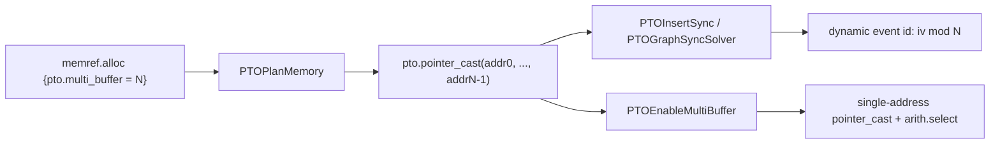

# PTOAS PR615 Multi Buffer 设计

## 1. 文档范围

本文描述 PR615 中 PTOAS multi-buffer 的设计与当前实现状态，参考 AscendNPU-IR 的 MultiBuffer 设计文档，但以 PTOAS PR615 的代码和测试为准。

参考文档目录：

- `C:\Users\rdp\Documents\npuir\AscendNPU-IR\docs\source\zh_cn\developer_guide\features\MultiBuffer`

PR615 覆盖的是 PTOAS local memory multi-buffer 主链路：

- `memref.alloc {pto.multi_buffer = N}` 作为入口语义。
- `PTOPlanMemory` 为一个逻辑 buffer 规划 N 份物理 local address。
- `PTOInsertSync` 或 `PTOGraphSyncSolver` 从多地址推导多 event id，并生成动态 event-id 同步。
- `PTOEnableMultiBuffer` 在同步之后把多地址 `pto.pointer_cast` 降成按 loop iteration 选择的单地址 buffer。

PR615 当前不覆盖以下 AscendNPU-IR 完整链路能力：

- 自动 `MarkMultiBuffer` 标记 pass。
- workspace / CV pipelining / preload 的 multi-buffer 路径。
- cross-core CV unroll/preload event-id 推导。
- GM 或动态地址场景的 multi-buffer 数据选择。

## 2. 设计目标

multi-buffer 的目标是把循环内复用的一个逻辑 local buffer 扩展成 N 份物理槽位。相邻迭代通过 `iv mod N` 轮转不同槽位，从而减少 loop-carried memory dependency 对流水化和自动同步的阻塞。

在 PTOAS 中，这条语义链不是一个最终 IR op，而是跨多个 pass 传递：



核心约束是同步 pass 必须先看到完整的多地址 `pto.pointer_cast`，因此 `PTOEnableMultiBuffer` 必须排在同步之后。

## 3. 与 AscendNPU-IR 设计的对应关系

| 阶段 | AscendNPU-IR / HIVM | PTOAS PR615 |
|---|---|---|
| 入口标记 | `annotation.mark {hivm.multi_buffer = N}` | `memref.alloc {pto.multi_buffer = N}` |
| 标记生成 | `MarkMultiBuffer` 自动标记 local/workspace/scope | 当前不提供自动标记，依赖前端或测试显式写 attr |
| 物理地址规划 | `PlanMemory` 扩展 `StorageEntry` 并写回多 offset | `PTOPlanMemory` 扩展 `relationOtherBuffers` 并写回多地址 `pto.pointer_cast` |
| 同步分析 | `InjectSync` / `GraphSyncSolver` 读取多地址，推导多 event id | `PTOInsertSync` / `PTOGraphSyncSolver` 读取 `BaseMemInfo.baseAddresses` 推导 N |
| 数据选择 | `EnableMultiBuffer` 用 loop counter 选择物理 buffer | `PTOEnableMultiBuffer` 用 `iv mod N` + `arith.select` 替换多地址 cast |
| workspace/CV/preload | 已设计为完整链路 | PR615 不覆盖，后续扩展 |

## 4. 用户可见接口

### 4.1 `pto.multi_buffer` 属性

multi-buffer 入口是 local `memref.alloc` 上的整数属性：

```mlir
%a = memref.alloc() {pto.multi_buffer = 2 : i32}
    : memref<16x16x16xf16, #pto.address_space<vec>>
```

约束如下：

- `N > 1` 才启用 multi-buffer。
- `N <= 16`，与 InsertSync 的 `MAX_MULTI_BUFFER_NUM` 保持一致。
- 当前只面向 local memory，最终数据选择 pass 只处理 `#pto.address_space<vec>` 和 `#pto.address_space<mat>`。
- attr 本身只表达“需要 N 份物理槽位”，不直接改变运行时选择逻辑。

### 4.2 CLI 开关

PR615 将数据选择 lowering 设计为显式开关：

```bash
ptoas input.pto --enable-insert-sync --enable-multi-buffer-lowering
ptoas input.pto --enable-graph-sync-solver --enable-multi-buffer-lowering
```

`--enable-multi-buffer-lowering` 排在同步 pass 之后运行。若只经过 PlanMemory 而没有开启该开关，多地址 `pto.pointer_cast` 会继续留在 IR 中；调用方需要把该开关与 multi-buffer 输入配套使用。

## 5. PlanMemory 设计

### 5.1 语义收集

`include/PTO/Transforms/MultiBuffer.h` 定义公共常量：

- `kPtoMultiBufferAttrName = "pto.multi_buffer"`
- `kPtoMultiBufferMaxNum = 16`

`MemLivenessAnalysis::collectMultiBufferAnnotations` 扫描 `memref.alloc`，读取合法的 `pto.multi_buffer`，并写入：

```text
buffer2MultiNum[allocResult] = N
```

这个阶段不分配地址，只把 IR attr 转换成内存规划输入。

### 5.2 StorageEntry 扩展

PlanMemory 使用 `StorageEntry::multiBufferNum` 表示一个逻辑 buffer 需要的物理槽数。PR615 将历史的 double-buffer-only `relationPongEntry` 扩展为通用 N-buffer 结构：

```text
StorageEntry primary
  multiBufferNum = N
  relationOtherBuffers = [slot1, slot2, ..., slotN-1]
```

`ExpandMultiBufferStorageEntry` 为每个 primary 创建 `N - 1` 个 sibling entry。所有 sibling 共享相同的 buffer info、lifetime、aligned size 和 inplace buffer 集合，但最终拥有不同的 `bitsOffset`。

为避免写回地址时重复处理 sibling，PR615 增加 `isMultiBufferSlot`：

- primary entry 负责写回 slot 0 到 slot N-1。
- sibling entry 不独立写回 `buffer2Offsets`。

### 5.3 Inplace 合并

当 inplace 把两个 storage entry 合并时，multi-buffer 数取最大值：

```text
merged.multiBufferNum = max(src.multiBufferNum, dst.multiBufferNum)
```

这样可以避免 multi-buffer buffer 被合并进 single-buffer entry 后丢失物理槽需求。

### 5.4 规划层级

PR615 将 local memory speculative planning 的 pipe-conflict 策略整理为四级：

| Level | 策略 |
|---|---|
| `SPEC_LEVEL_3` | 最保守，任何 pipe conflict 都阻止复用，作为初始尝试 |
| `SPEC_LEVEL_2` | 只有同一 parent loop 内的 pipe conflict 阻止复用 |
| `SPEC_LEVEL_1` | 允许 single buffer 复用历史 multi-buffer 槽，也允许 multi-buffer 复用历史 multi-buffer 槽 |
| `SPEC_LEVEL_0` | 只按 lifetime 复用 |

`SPEC_LEVEL_1` 复用时要求：

- 当前 entry 与历史 reuse entry 能找到同一个 parent loop。
- 如果当前 entry 也是 multi-buffer，其 relation slots 已经规划出 offset。
- 候选 relation slot 与历史规划没有 lifetime 或 semantic conflict。

PR615 支持枚举历史 multi-buffer 的全部 relation slots，而不是只取最后一个 slot，因此 N 大于 2 的场景也能获得复用机会。

### 5.5 地址写回

`UpdateBuffer2Offsets` 维护关键槽位顺序契约：

```text
buffer2Offsets[buffer][i] == runtime slot selected by (iv mod N == i)
```

写回顺序为：

1. primary entry 的 `bitsOffset` 作为 slot 0。
2. `relationOtherBuffers[0]` 到 `relationOtherBuffers[N-2]` 作为 slot 1 到 slot N-1。

随后 `AllocToPointerCast` 将 local `memref.alloc` 改写为多地址 `pto.pointer_cast`：

```mlir
%a = pto.pointer_cast(%addr0, %addr1, ..., %addrN_1)
    : memref<..., #pto.address_space<vec>>
```

### 5.6 重试与诊断

multi-buffer 会显著增加 local memory 压力，也会放大 gen/kill 顺序对规划结果的影响。PR615 在 `PlanMemoryPass` 中加入最多 20 次 deterministic retry：

- 第一次使用 seed 0，保持原有稳定顺序。
- 后续 attempt 使用不同 seed 打乱 liveness candidate 顺序。
- 中间失败抑制诊断，只在最后一次失败时报告错误。

multi-buffer 专用的不变量失败通过 `emitMultiBufferError` 转换为可恢复失败，而不是直接 abort，使 retry 有机会恢复。

## 6. 同步设计

### 6.1 多地址进入依赖分析

`PTOIRTranslator::UpdatePointerCastOpMemInfo` 会把 `pto.pointer_cast` 的所有地址操作数写入：

```text
BaseMemInfo.baseAddresses = [addr0, addr1, ..., addrN-1]
```

如果地址不是编译期常量，则设置 `hasVariableAddress = true`。这种场景无法证明槽位不重叠，同步分析会回退为 single-buffer。

别名传播时，静态 view/subview delta 会加到每个 physical slot，而不是只改 slot 0。

### 6.2 Multi-buffer eligibility

`MemoryDependentAnalyzer::getMultiBufferSlotCount` 用同一套规则服务 `PTOInsertSync` 和 `PTOGraphSyncSolver`。

一个依赖对只有满足以下条件才返回 `N`：

- 两侧都有相同数量的 `baseAddresses`。
- `N >= 2`。
- 两侧地址都是常量地址。
- buffer size 非零。
- 同 index slot 必须 overlap，代表同一物理 slot 上存在真实依赖。
- 不同 index slot 必须不 overlap，代表相邻迭代能落到不同物理 slot。

任一条件不满足时返回 0，并按 single-buffer 同步处理。

### 6.3 PTOInsertSync 路径

`InsertSyncAnalysis::GetEventIdNum` 只对 loop back-edge dependency 尝试 multi-buffer：

- forward dependency 直接返回 `eventIdNum = 1`。
- 每个依赖对都必须 multi-buffer eligible。
- 所有依赖对必须推导出同一个 N。
- 所有相关 buffer 必须挂在同一个 back-edge `scf.for` 下。

PR615 使用 `BaseMemInfo::baseBuffer` 找 enclosing `scf.for`。这是 PTOAS 的关键差异：`pto.pointer_cast` 的 `rootBuffer` 往往是函数入口处的 i64 address，不能代表原始 alloc 所在 loop。

同步插入结果：

- set/wait pair 记录 `eventIdNum = N`。
- event id allocator 优先申请 N 个 event ids。
- 如果资源不足，N 为奇数或 N=2 时回退到 1；N 为偶数且大于 2 时优先回退到 2，再回退到 1。
- codegen 使用 `pto.set_flag_dyn` / `pto.wait_flag_dyn`，event id value 由 `iv mod N` 选择。

典型形态：

```text
pre-loop:
  set_flag EVENT_ID0
  set_flag EVENT_ID1

loop body:
  idx = iv mod 2
  eid = select(idx == 1, EVENT_ID1, EVENT_ID0)
  wait_flag_dyn eid
  ...
  set_flag_dyn eid

post-loop:
  wait_flag EVENT_ID0
  wait_flag EVENT_ID1
```

同一 DMA pipe 的 loop back-edge dependency 在 multi-buffer eligible 或硬件 DMA 队列天然有序时可以跳过额外 `PIPE_BARRIER`；`PIPE_M` / `PIPE_V` 保持保守 barrier 行为。

### 6.4 PTOGraphSyncSolver 路径

GraphSyncSolver 使用 `EventIdInfo` 表示 multi-buffer 同步几何：

```text
EventIdInfo {
  eventIdNum
  multibufferLoop
}
```

推导策略：

1. 只处理 backward sync。
2. 用 `getMultiBufferSlotCount` 校验冲突读写集合。
3. 要求所有冲突对共享同一个 N。
4. 要求所有相关 buffer 共享同一个 `scf.for`。
5. 成功后在 EventIdSolver 中为该 conflict pair 创建需要 N 个颜色的 node。

如果 N 个 event ids 无法被 coloring 满足，GSS 先回退到 single event id；仍不可着色时降级为 `PIPE_ALL` barrier。

GSS codegen 的 multi-buffer 输出与 InsertSync 保持同一形态：pre-loop prime、loop 内 dyn wait/set、post-loop drain。

PR615 的 GSS port 仅覆盖普通 local memory multi-buffer。AscendNPU-IR 中的 CV unroll、preload offset、cross-core block selector 当前未移植。

## 7. EnableMultiBuffer 设计

`PTOEnableMultiBuffer` 是数据 buffer 选择的最终落地 pass。它消费同步阶段已经使用过的多地址 `pto.pointer_cast`。

匹配对象：

```mlir
%a = pto.pointer_cast(%addr0, %addr1, ..., %addrN_1)
    : memref<..., #pto.address_space<vec>>
```

当前 guard：

- address 数量必须大于 1。
- result memory space 必须是 `VEC` 或 `MAT`。
- 必须有 enclosing `scf.for`。
- address operands 必须定义在 loop 外，保证 hoist 后 SSA dominance 正确。

lowering 过程：

1. 在 enclosing `scf.for` 之前 hoist N 个单地址 `pto.pointer_cast`。
2. 在 loop body 开头创建或复用 `(loop, N)` 对应的 `arith.remui iv, N`。
3. 生成 N-way `arith.select` 链。
4. 用 selected buffer 替换原多地址 `pto.pointer_cast`。

示意：

```mlir
%slot0 = pto.pointer_cast(%addr0) : memref<..., #pto.address_space<vec>>
%slot1 = pto.pointer_cast(%addr1) : memref<..., #pto.address_space<vec>>

scf.for %iv = %c0 to %c4 step %c1 {
  %idx = arith.remui %iv, %c2 : index
  %is1 = arith.cmpi eq, %idx, %c1 : index
  %a = arith.select %is1, %slot1, %slot0
  ...
}
```

同一个 loop 内同一个 N 的多个 pointer_cast 会复用同一个 counter，避免重复生成 `iv mod N`。

当前实现只检查 address operands 的 loop-invariance。若未来 `validRow` / `validCol` 或 config 中出现 loop-local 动态值，需要同步补充 dominance guard 或调整 hoist 策略。

## 8. 端到端示例

输入：

```mlir
scf.for %i = %c0 to %c4 step %c1 {
  %a = memref.alloc() {pto.multi_buffer = 2 : i32}
      : memref<16x16x16xf16, #pto.address_space<vec>>
  pto.tload ins(%gm0 : memref<16x16x16xf16, #pto.address_space<gm>>)
           outs(%a : memref<16x16x16xf16, #pto.address_space<vec>>)
  pto.tstore ins(%a : memref<16x16x16xf16, #pto.address_space<vec>>)
            outs(%gm1 : memref<16x16x16xf16, #pto.address_space<gm>>)
}
```

PlanMemory 后：

```mlir
scf.for %i = %c0 to %c4 step %c1 {
  %a = pto.pointer_cast(%addr0, %addr1)
      : memref<16x16x16xf16, #pto.address_space<vec>>
  ...
}
```

同步后：

```text
set_flag EVENT_ID0
set_flag EVENT_ID1

scf.for %i = ... {
  %idx = %i mod 2
  %eid = select(%idx == 1, EVENT_ID1, EVENT_ID0)
  wait_flag_dyn %eid
  ...
  set_flag_dyn %eid
}

wait_flag EVENT_ID0
wait_flag EVENT_ID1
```

EnableMultiBuffer 后：

```text
slot0 = pointer_cast(addr0)
slot1 = pointer_cast(addr1)

scf.for %i = ... {
  idx = %i mod 2
  selected = select(idx == 1, slot1, slot0)
  ...
}
```

## 9. 测试覆盖

PR615 增加或调整的关键 lit 测试包括：

| 测试 | 覆盖点 |
|---|---|
| `test/lit/pto/plan_memory_multi_buffer_double.pto` | PlanMemory 将 `pto.multi_buffer = 2` 写回为双地址 `pto.pointer_cast` |
| `test/lit/pto/enable_multi_buffer_lowering.pto` | `PTOEnableMultiBuffer` 拆分多地址 cast 并生成 `arith.select` |
| `test/lit/pto/multi_buffer_insert_sync_dyn_event_id.pto` | InsertSync 推导 N=2 并生成 dyn event-id 同步 |
| `test/lit/pto/multi_buffer_n4_insert_sync.pto` | N=4 relation slots、N-way select 和 event-id fallback |
| `test/lit/pto/multi_buffer_nested_loop.pto` | nested loop 中选择正确的 inner loop induction variable |
| `test/lit/pto/multi_buffer_gss_dyn_event_id.pto` | GraphSyncSolver multi-buffer event-id 推导与 codegen |
| `test/lit/pto/issue564_k_loop_mte1_mte2_wait_regression.pto` | 既有 InsertSync 行为在 multi-buffer 改动下不回退 |

建议验证命令：

```bash
lit test/lit/pto/plan_memory_multi_buffer_double.pto
lit test/lit/pto/enable_multi_buffer_lowering.pto
lit test/lit/pto/multi_buffer_insert_sync_dyn_event_id.pto
lit test/lit/pto/multi_buffer_gss_dyn_event_id.pto
```

## 10. 当前限制与后续方向

当前限制：

- 没有自动标记 pass，`pto.multi_buffer` 需要前端显式产生。
- `--enable-multi-buffer-lowering` 是显式开关，未开启时数据 buffer 选择不会落地。
- 数据选择 lowering 当前只处理 `VEC` / `MAT` local memory。
- 动态地址无法证明 slot disjoint，event-id 推导会回退 single-buffer。
- 同一个 back-edge 上所有依赖对必须推导出相同 N，否则回退 single-buffer。
- `PTOEnableMultiBuffer` 只支持 enclosing `scf.for`；非 `scf.for` loop-like 场景会跳过。
- workspace / CV pipeline / preload 的 multi-buffer 语义尚未移植。

后续可扩展方向：

- 增加 PTOAS 版 `MarkMultiBuffer`，从 load/store/tload/tstore 模式自动标记 local buffer。
- 将 `--enable-multi-buffer-lowering` 与存在多地址 local `pto.pointer_cast` 的场景自动联动，或在未启用时给出诊断。
- 扩展 workspace / CV / preload 路径，对齐 AscendNPU-IR 的完整 MultiBuffer pipeline。
- 为 dynamic valid shape、dynamic address 与非 `scf.for` loop 增加更明确的 guard 或合法 lowering。
- 将 GraphSyncSolver 的 CV unroll/preload event-id selector 从 NPU-IR 设计逐步移植到 PTOAS。
